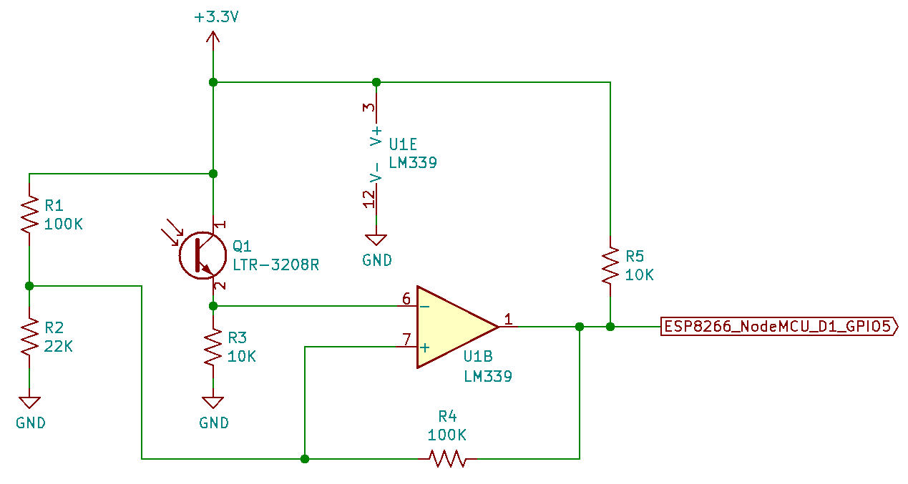

# Read an AC Power Meter using IR Pulses

Many AC power meters (e.g., residential power meeter on a house) have an infrared (IR) LED that blinks every watt-hour.

This Arduino code calculates power from the flashing LED and publishes the power/energy information as an MQTT message.

This code runs on an ESP8266/NodeMCU.  For example,

https://www.amazon.com/gp/product/B01IK9GEQG/ref=ppx_yo_dt_b_search_asin_title?ie=UTF8&th=1

# Usage

A `secrets.h` file is required in the same folder as the .ino file (supplied by user, not in repo).  This file must contain the SSID and password of the WiFi network used:

```
#define SECRETS_WIFI_SSID           "your-wifi-ssid"
#define SECRETS_WIFI_PASSWORD       "your-wifi-password"
```

# Phototransitor IR Detector Schematic

The IR photodetector circuit consists of an IR phototransistor (to sense the blinking IR light from the AC power meter) and an inverting comparator with hysteresis.



Notes:

* The ESP8266/NodeMCU board (not shown) is powered using a USB 5V AC adapter.
* Power the circuit using 3.3V from the ESP8266/NodeMCU board.
* Pin D1 (GPIO5) of the ESP8266/NodeMCU connects to the output of the comparator as shown.
* The output of the IR phototransistor circuit is connected to pin 6 of the LM339 comparator IC. The threshold might have to be tuned (change the resistor values) based on brightness of the power meter's IR LED (and corresponding voltage change of the IR phototransistor circuit output).  See Inverting Comparator with Hysteresis section of TI's [AN-74](http://www.ti.com/lit/an/snoa654a/snoa654a.pdf) for calculating resistor values.
